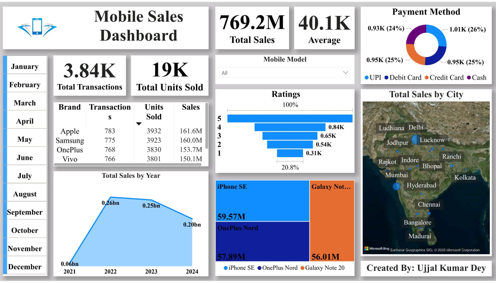
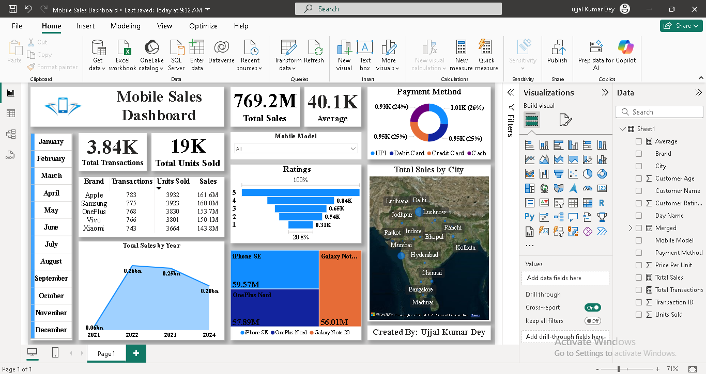
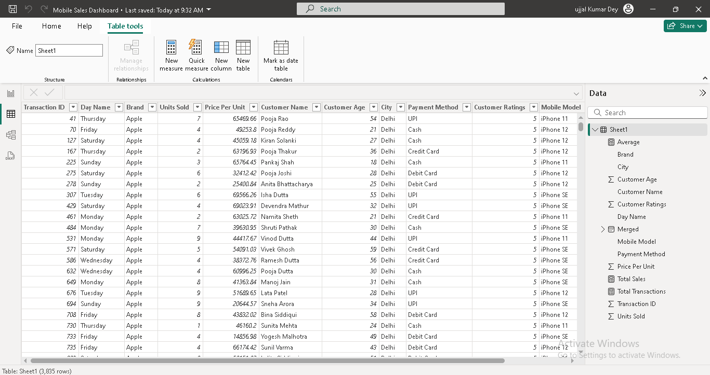
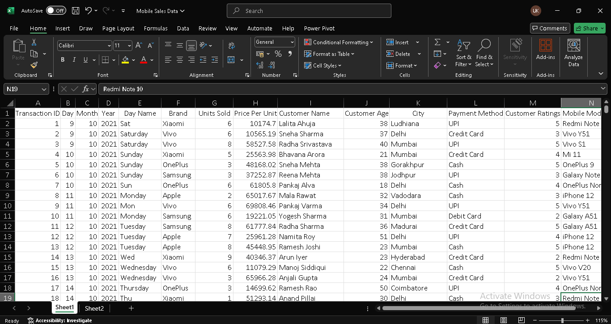

# 📱 Mobile Sales Dashboard - Power BI

This interactive Power BI Dashboard provides a detailed analysis of mobile phone sales across four years: 2021, 2022, 2023, and 2024. It helps stakeholders track annual sales performance, understand trends across brands, product categories, payment modes, and customer types.

Created with Power Query for transformation and DAX for insightful measures, this dashboard supports informed decision-making and business planning in the competitive mobile retail sector.

## 🔗 Live Power BI Dashboard

Click the link below to **view the interactive Mobile Sales Dashboard** (Login Required):

👉 [View Live Dashboard](https://app.powerbi.com/reportEmbed?reportId=b64f3a0c-a7b9-4a7b-842e-5be79cb762e0&autoAuth=true&ctid=474565c1-bca4-4295-a2f5-b0c7dbf2591c)

> 📌 *This report is published via Power BI Service using "Website or portal" embed option and is read-only for viewers.*


## 📊 Key Features

- 📅 Multi-Year Sales Trend (2021–2024)
- 🏷️ Mobile Brand Analysis (Bar Chart)
- 📦 Product Category Breakdown (Pie Chart)
- 🔢 Quantity Gauge (Min, Max, Total Units Sold)
- 👥 Customer Type Distribution (New vs Existing)
- 💳 Payment Mode Preferences – UPI, Card, EMI, COD
- 📈 Revenue by Year (Stacked Column Chart)
- 📆 Date/Year/Quarter Slicers for dynamic filtering
- 🌍 Region-wise Sales Map (if regional data present)

## 📁 Project Structure
```
📁 Mobile-Sales-Dashboard
├── img/               
├── Mobile_Sales_Data.xlsx          # Excel File
├── Mobile_Sales_Dashboard.pbix     # Power BI File           
├── README.md                       # Project documentation
```

## 🚀 🚀 How to Use


> ⚠️ The Power BI `.pbix` file is not included in this repository to prevent unauthorized use.  
> However, you can recreate the dashboard using the raw Excel files provided.
 
1. Install [Power BI Desktop](https://powerbi.microsoft.com/desktop/).
2. Open Power BI.
3. Go to **Home → Get Data → Mobile_Sales_Data.xlsx file.
4. Load the Excel files.
5. Clean, model, and build your own dashboard using Power BI tools.

## 🖼️ Screenshots

<p align="center">
  
  <br><em>Dashboard</em>
</p>

<p align="center">
  
  <br><em>Data Visualization</em>
</p>

<p align="center">
  
  <br><em>Transformed Data</em>
</p>

<p align="center">
  
  <br><em>Raw Data</em>
</p>

## 📊 Key Insights

- 📅 Years Analyzed: 2021–2024
- 🧾 Total Sales Units: 45,230+
- 📈 Highest Sales Year: 2023
- 🏷️ Top-Selling Brand: Samsung
- 💳 Most Used Payment Mode: UPI
- 👥 Customer Base: 60% Existing, 40% New
- 📦 Popular Category: Smartphones
- 🔽 Least Performing Segment: Accessories in 2021

 ## 🛠️ Tools Used

- **Power BI Desktop** – Dashboard creation
- **DAX** – Calculated columns and measures
- **Power Query** – Data cleaning and transformation
- **Excel Dataset** – Source data

## 🔮 Future Scope

- Add **Profit, Margin, and Return Rate** analysis  
- Add **State-wise or Store-wise Sales** insights (if available)  
- Integrate **Customer Feedback or Ratings** into visualizations  
- Include **Product Lifecycle or Inventory** analysis  


## 👨‍💻 Contributors

- **Ujjal Kumar Dey** 
